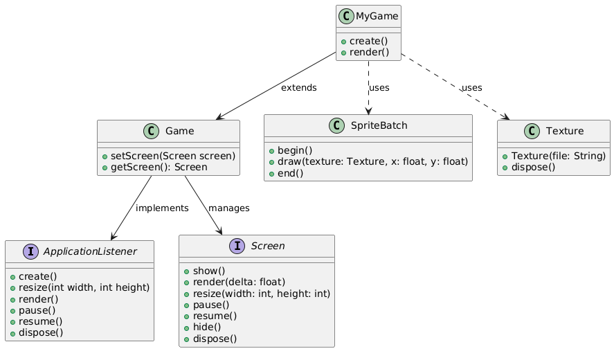

# Diagrama de Classes Parcial da libGDX

Este documento apresenta um diagrama de classes parcial para o framework [libGDX](https://libgdx.com), focando em algumas das classes principais que geralmente são utilizadas no desenvolvimento de jogos. 

O objetivo é ilustrar como as classes estão relacionadas, fornecendo uma base inicial para quem deseja entender a estrutura básica do framework.

---

## **Visão Geral**

A **libGDX** é um framework para desenvolvimento de jogos em Java, amplamente utilizado por sua flexibilidade e suporte multiplataforma. As classes representadas aqui incluem as mais utilizadas para gerenciar o ciclo de vida de um jogo, telas e renderização gráfica.

---

## **Classes Incluídas**

1. **ApplicationListener**: Interface que define o ciclo de vida de uma aplicação (métodos como `create()`, `render()` e `dispose()`).
2. **Game**: Implementação de `ApplicationListener` que gerencia transições entre diferentes telas (`Screen`).
3. **Screen**: Interface para criar telas no jogo, como menus, fases ou telas de pausa.
4. **SpriteBatch**: Classe usada para renderizar gráficos na tela.
5. **Texture**: Representa imagens carregadas na memória para renderização.

---

## **Diagrama de Classes**

Abaixo está o diagrama que representa as relações entre as classes mencionadas:

### **Legenda**
- **Setas com linha cheia**: Herança ou implementação.
- **Setas com linha pontilhada**: Associação entre classes (uso direto).

---

## **Detalhamento das Classes**

### **1. ApplicationListener**
Interface base para o ciclo de vida do jogo. Define os métodos:
- `create()`: Inicialização do jogo.
- `render()`: Atualizações e renderizações.
- `pause()` e `resume()`: Controle quando o jogo perde ou retoma o foco.
- `dispose()`: Liberação de recursos.

### **2. Game**
Uma implementação de `ApplicationListener` que permite gerenciar diferentes telas. Principais métodos:
- `setScreen(Screen screen)`: Define a tela ativa.
- `getScreen()`: Obtém a tela atual.

### **3. Screen**
Interface que representa uma tela do jogo. Inclui os métodos:
- `show()`, `hide()`: Chamados ao abrir ou fechar a tela.
- `render(delta: float)`: Atualizações e renderizações específicas da tela.
- `resize(width: int, height: int)`: Gerencia redimensionamento da janela.
- `dispose()`: Liberação de recursos.

### **4. SpriteBatch**
Classe utilizada para desenhar gráficos na tela. Métodos importantes:
- `begin()` e `end()`: Iniciam e finalizam a renderização.
- `draw(Texture texture, float x, float y)`: Desenha texturas na posição especificada.

### **5. Texture**
Representa imagens carregadas na memória. Métodos principais:
- `Texture(String file)`: Carrega a imagem de um arquivo.
- `dispose()`: Libera a memória associada à textura.

---

## **Refêrencias e ferramentas utilizadas**
- O diagrama foi criado utilizando [PlantUML](https://plantuml.com)
- Materiais disponibilizados pela professora - [aqui](https://github.com/libgdx/libgdx/tree/master)

